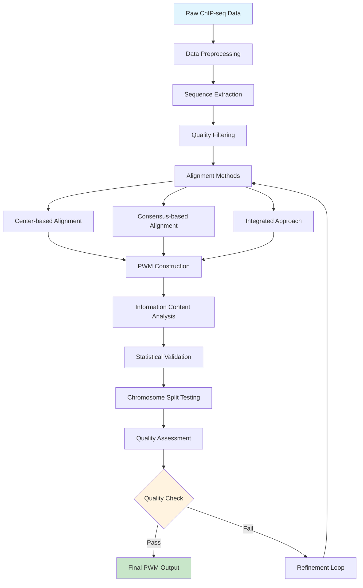

# System Architecture

> **🏗️ Pipeline Design and Data Flow**  
> Understanding the CTCF PWM Testing Pipeline's modular architecture, data flow, and integration patterns.

## 🎯 Pipeline Overview

The CTCF PWM Testing Pipeline follows a **quality-first, modular architecture** designed to build high-quality Position Weight Matrices through progressive refinement and validation.

### Core Design Principles

1. **Quality Over Quantity** - Small, high-quality datasets outperform large, noisy ones
2. **Modular Processing** - Independent stages with clear interfaces
3. **Validation-Driven** - Continuous quality assessment at each step
4. **Reproducible Results** - Deterministic outputs with full traceability

## 🔄 Data Flow Architecture



## 🧩 Module Architecture

### 1. Data Preparation Layer

**Primary Scripts:**
- `prepare_data.R` - Initial data preprocessing
- `extract_sequences.R` - Peak-to-sequence conversion
- `filter_sequences.R` - Quality control and filtering

**Data Flow:**
```
ChIP-seq Peaks → Sequence Extraction → Quality Filtering → Clean Dataset
```

**Key Functions:**
- Peak validation and filtering
- Sequence length normalization
- Quality score assessment
- Duplicate removal

### 2. Alignment Engine

**Core Scripts:**
- `align_center.R` - Center-based alignment
- `align_consensus.R` - Consensus-driven alignment
- `align_integrated.R` - Hybrid approach

**Alignment Strategies:**
```
Center-based:     [----MOTIF----]  ← Fixed center position
Consensus-based:  MOTIF[--------]  ← Pattern-driven alignment
Integrated:       [--MOTIF------]  ← Best of both methods
```

**Quality Metrics:**
- Information content improvement
- Alignment stability
- Pattern recognition accuracy

### 3. PWM Construction Core

**Main Script:** `build_pwm_robust.R`

**Processing Pipeline:**
```
Aligned Sequences → Frequency Matrix → Probability Matrix → Information Content → PWM
```

**Key Components:**
- Pseudocount handling
- Background probability adjustment
- Information content calculation
- Quality scoring

### 4. Validation Framework

**Validation Scripts:**
- `validate_chromosome_split.R` - Cross-validation testing
- `statistical_validation.R` - Statistical significance testing
- `null_model_analysis.R` - Background comparison

**Validation Types:**
- **Chromosome Split Testing** - Train/test separation
- **Statistical Significance** - P-value calculation
- **Null Model Comparison** - Random background testing
- **Cross-validation** - Multiple fold validation

### 5. Quality Assessment Engine

**Assessment Scripts:**
- `assess_quality.R` - Comprehensive quality metrics
- `analyze_conservation.R` - Conservation pattern analysis
- `generate_reports.R` - Result compilation

**Quality Dimensions:**
- Information content analysis
- Conservation pattern recognition
- Statistical significance
- Biological relevance

## 🔧 Integration Patterns

### Sequential Processing

**Standard Pipeline Flow:**
```bash
# 1. Data preparation
Rscript scripts/prepare_data.R

# 2. Alignment
Rscript scripts/align_sequences.R

# 3. PWM construction
Rscript scripts/build_pwm_robust.R

# 4. Validation
Rscript scripts/validate_chromosome_split.R

# 5. Quality assessment
Rscript scripts/assess_quality.R
```

### Parallel Processing Options

**Multi-method Comparison:**
```bash
# Run multiple alignment methods in parallel
./scripts/run_parallel_alignment.sh

# Compare results and select best method
Rscript scripts/compare_methods.R
```

### Docker Integration

**Containerized Execution:**
```bash
# Full pipeline in Docker
docker-compose up pipeline

# Individual module execution
docker run ctcf-pipeline Rscript scripts/build_pwm_robust.R
```

## 📊 Data Structures

### Input Data Format

**ChIP-seq Peaks:**
```
chr1:1000000-1000200  score=850  pvalue=1e-10
chr2:2000000-2000200  score=920  pvalue=1e-12
chr3:3000000-3000200  score=780  pvalue=1e-9
```

**Sequence Format:**
```
>peak_1_chr1:1000000-1000200
ATCGATCGATCGCCGCGNNGGNGGCAGATCGATCG
>peak_2_chr2:2000000-2000200
GCTAGCTAGCGCCGCGNNGGNGGCAGGCTAGCTAG
```

### Intermediate Data Structures

**Alignment Matrix:**
```
        1  2  3  4  5  6  7  8  9 10 11 12 13 14 15
Seq1:   C  C  G  C  G  A  T  G  G  T  G  G  C  A  G
Seq2:   C  C  G  C  G  C  C  G  G  A  G  G  C  A  G
Seq3:   C  C  G  C  G  T  A  G  G  C  G  G  C  A  G
```

**PWM Structure:**
```r
pwm <- list(
  frequency_matrix = matrix(...),
  probability_matrix = matrix(...),
  information_content = c(...),
  total_ic = numeric(1),
  conserved_positions = integer(...)
)
```

### Output Data Format

**PWM File (MEME Format):**
```
MEME version 4
ALPHABET= ACGT
Background letter frequencies
A 0.25 C 0.25 G 0.25 T 0.25

MOTIF CTCF_PWM
...
```

**Quality Report:**
```json
{
  "total_information_content": 19.592,
  "conserved_positions": 12,
  "conservation_ratio": 0.80,
  "statistical_significance": 1e-15,
  "quality_grade": "EXCELLENT"
}
```

## 🔀 Configuration Management

### Parameter Hierarchy

**Configuration Sources (Priority Order):**
1. Command-line arguments
2. Environment variables
3. Configuration files
4. Default values

**Config File Structure:**
```yaml
# config/pipeline.yml
alignment:
  method: "integrated"
  center_window: 50
  consensus_threshold: 0.8

quality:
  min_information_content: 8.0
  min_conserved_positions: 3
  statistical_threshold: 0.01

output:
  format: "meme"
  include_plots: true
  verbose: true
```

### Environment Variables

**Key Variables:**
```bash
CTCF_DATA_DIR="/path/to/data"
CTCF_OUTPUT_DIR="/path/to/results"
CTCF_TEMP_DIR="/tmp/ctcf"
CTCF_THREADS=4
CTCF_MEMORY_LIMIT="8G"
```

## 🔄 Error Handling and Recovery

### Failure Points and Recovery

**Data Preparation Failures:**
- **Issue**: Missing input files
- **Recovery**: Automatic fallback to example data
- **Script**: `scripts/handle_missing_data.R`

**Alignment Failures:**
- **Issue**: Poor alignment quality
- **Recovery**: Try alternative alignment method
- **Script**: `scripts/alignment_fallback.R`

**Memory Issues:**
- **Issue**: Out of memory errors
- **Recovery**: Reduce batch size, use disk-based processing
- **Script**: `scripts/memory_management.R`

### Logging and Monitoring

**Log Levels:**
- `DEBUG`: Detailed processing information
- `INFO`: General pipeline progress
- `WARN`: Non-fatal issues and warnings
- `ERROR`: Fatal errors requiring intervention

**Log Format:**
```
[2024-01-15 10:30:15] INFO  [build_pwm_robust.R] Starting PWM construction
[2024-01-15 10:30:16] DEBUG [build_pwm_robust.R] Processing 1000 sequences
[2024-01-15 10:30:20] INFO  [build_pwm_robust.R] PWM construction complete: IC=19.592
```

## 🚀 Performance Optimization

### Computation Optimization

**Parallel Processing:**
- Multi-core alignment processing
- Parallel validation runs
- Batch sequence processing

**Memory Management:**
- Streaming large datasets
- Efficient data structures
- Garbage collection optimization

**Disk I/O Optimization:**
- Efficient file formats
- Compressed intermediate files
- Optimized file access patterns

### Scalability Considerations

**Horizontal Scaling:**
- Docker Swarm support
- Kubernetes deployment
- Cloud-native architecture

**Vertical Scaling:**
- Memory usage optimization
- CPU-intensive task optimization
- I/O bottleneck elimination

## 🔗 Integration Points

### External Tool Integration

**R Packages:**
- `Biostrings` - Sequence manipulation
- `GenomicRanges` - Genomic coordinates
- `seqLogo` - Motif visualization
- `ROCR` - Performance evaluation

**External Tools:**
- `bedtools` - Genomic interval operations
- `samtools` - Sequence file processing
- `MEME Suite` - Motif analysis

### API Endpoints

**REST API (if enabled):**
```
POST /api/v1/pwm/build
GET  /api/v1/pwm/{id}/status
GET  /api/v1/pwm/{id}/results
GET  /api/v1/pwm/{id}/quality
```

## 🔍 Monitoring and Debugging

### Performance Metrics

**Key Performance Indicators:**
- Processing time per stage
- Memory usage patterns
- Quality improvement metrics
- Success/failure rates

**Monitoring Dashboard:**
- Real-time pipeline status
- Resource utilization
- Quality trends
- Error rates

### Debugging Tools

**Built-in Debugging:**
- Verbose logging modes
- Intermediate result inspection
- Step-by-step execution
- Quality checkpoint validation

**External Debugging:**
- R debugging tools
- Memory profiling
- Performance analysis
- Docker container inspection

---

## 📖 Next Reading

- **[Scripts Reference](08-scripts-reference.md)** - Detailed documentation of all scripts
- **[Configuration Guide](09-configuration.md)** - Complete parameter reference
- **[User Guide](10-user-guide.md)** - Step-by-step usage instructions

---

*This architecture supports the pipeline's core mission: transforming raw ChIP-seq data into high-quality, biologically meaningful Position Weight Matrices through systematic, validated processing.*
