# User Guide

> **👨‍💻 Complete guide to running the CTCF PWM Testing Pipeline**

## Overview

This guide covers practical usage of the CTCF PWM Testing Pipeline from basic operations to advanced customizations. Whether you're a researcher, bioinformatician, or developer, this guide will help you effectively use the pipeline.

## Basic Operations

### Quick Demo Run

**Test the pipeline in 5 minutes**:
```bash
# Start Docker environment
./smart-startup.sh

# Run demo with small dataset
./run-in-docker.sh test_chromosome_split.R demo

# Expected output: PWM with 8-12 bits information content
```

### Standard Pipeline Run

**Full pipeline execution (30 minutes)**:
```bash
# Run complete analysis with all methods
./test_pwm_improvements_with_null_analysis.sh

# Monitor progress
tail -f results/*.log
```

**Alternative: Step-by-step execution**:
```bash
# 1. Download and prepare data
./run-in-docker.sh scripts/download_data.sh

# 2. Build basic PWM
./run-in-docker.sh scripts/simple_aligned_pwm.R

# 3. Build quality-filtered PWMs
./run-in-docker.sh scripts/build_subset_pwm.R 1000 2000 5000

# 4. Generate comparison report
./run-in-docker.sh scripts/enhanced_compare_pwms.R
```

## Understanding the Workflow

### Pipeline Phases

```mermaid
graph TD
    A[📥 Data Download] --> B[🔍 Preprocessing]
    B --> C[📊 Dataset Preparation]
    C --> D[🧬 Sequence Alignment]
    D --> E[🏗️ PWM Building]
    E --> F[📈 Statistical Validation]
    F --> G[📋 Results Analysis]
    
    style A fill:#e1f5fe
    style B fill:#f3e5f5
    style C fill:#e8f5e8
    style D fill:#fff3e0
    style E fill:#fce4ec
    style F fill:#f1f8e9
    style G fill:#e0f2f1
```



### Data Flow

1. **Data Download**: ENCODE CTCF ChIP-seq peaks + hg38 reference
2. **Preprocessing**: Quality filtering and sequence extraction
3. **Dataset Preparation**: Train/test split with chromosome-based validation
4. **Sequence Alignment**: Multiple alignment methods tested
5. **PWM Building**: Various construction approaches
6. **Statistical Validation**: Comparison with null models
7. **Results Analysis**: Quality assessment and comparison

## Working with Different Datasets

### Using Custom Data

**Format Requirements**:
```bash
# BED format for peaks
chr1    1000    1200    peak1    100    .
chr1    2000    2300    peak2    150    .

# Or FASTA format for sequences
>sequence1
ATCGCCGCGNGGATGCAG...
>sequence2
TTCGCCGCGNGGTCGCAT...
```

**Custom data pipeline**:
```bash
# Place your data files
cp your_peaks.bed data/custom_peaks.bed
cp your_sequences.fasta data/custom_sequences.fasta

# Run with custom data
./run-in-docker.sh scripts/build_pwm_robust.R data/custom_sequences.fasta
```

### Dataset Size Guidelines

| **Dataset Size** | **Processing Time** | **Memory Required** | **Recommended Use** |
|------------------|-------------------|-------------------|-------------------|
| 100-1,000 sequences | 2-5 minutes | 2GB | Quick testing, validation |
| 1,000-10,000 sequences | 15-30 minutes | 4-8GB | Standard analysis |
| 10,000-50,000 sequences | 1-2 hours | 8-16GB | Research projects |
| 50,000+ sequences | 2+ hours | 16-32GB | Large-scale studies |

## Configuration and Customization

### Preprocessing Configuration

**Edit `scripts/preprocess_config_optimized.json`**:
```json
{
  "length_filter": {
    "min_length": 11,
    "max_length": 200,
    "target_length": 50
  },
  "quality_filter": {
    "max_n_ratio": 0.15,
    "entropy_threshold": 1.5,
    "min_gc_content": 0.2,
    "max_gc_content": 0.8
  },
  "alignment_options": {
    "method": "consensus",
    "gap_penalty": -1.0,
    "similarity_threshold": 0.8
  }
}
```

### PWM Building Parameters

**Quality-focused approach** (recommended):
```bash
# Build high-quality subset PWMs
./run-in-docker.sh scripts/build_subset_pwm.R 1000 2000 5000

# Expected: Excellent information content (>15 bits)
```

**Comprehensive approach**:
```bash
# Test all alignment methods
./run-in-docker.sh scripts/compare_alignment_methods.R

# Build robust PWMs with error handling
./run-in-docker.sh scripts/build_pwm_robust.R
```

### Memory and Performance Tuning

**Memory-limited systems** (4-8GB):
```bash
# Use efficient algorithms
export CTCF_MEMORY_LIMIT="4GB"
export CTCF_BATCH_SIZE="500"
./run-in-docker.sh scripts/efficient_aligned_pwm.R
```

**High-performance systems** (16GB+):
```bash
# Enable parallel processing
export CTCF_THREADS="8"
export CTCF_BATCH_SIZE="5000"
./run-in-docker.sh scripts/advanced_alignment.R
```

## Interpreting Results

### Key Output Files

**Primary PWM Models**:
```bash
results/
├── simple_aligned_pwm.rds          # Basic PWM (fast)
├── subset_pwm_size1000.rds         # High-quality PWM (recommended)
├── robust_pwm.rds                  # Error-resistant PWM
└── advanced_consensus_basic.rds    # Advanced alignment PWM
```

**Quality Assessment**:
```bash
# Load and examine PWM quality
Rscript -e "
pwm <- readRDS('results/subset_pwm_size1000.rds')
cat('Total Information:', pwm$total_info, 'bits\n')
cat('Quality Grade:', pwm$quality_grade, '\n')
"
```

### Quality Indicators

**Excellent Quality (>15 bits)**:
- Suitable for drug discovery applications
- Publication-ready results
- Clear CTCF motif pattern visible

**Good Quality (8-15 bits)**:
- Suitable for research applications
- Functional binding site prediction
- Comparative genomics studies

**Poor Quality (<8 bits)**:
- Requires investigation and improvement
- May indicate data quality issues
- Not recommended for applications

### Visual Analysis

**Generate comparison plots**:
```bash
# Create comprehensive comparison report
./run-in-docker.sh scripts/enhanced_compare_pwms.R

# View results
open results/enhanced_pwm_comparison.html
```

**Manual plotting**:
```r
# Load PWM and create logo plot
library(ggplot2)
pwm <- readRDS('results/subset_pwm_size1000.rds')

# Plot information content per position
ic_data <- data.frame(
  Position = 1:ncol(pwm$pwm),
  IC = apply(pwm$pwm, 2, function(x) 2 + sum(x * log2(x + 1e-10)))
)

ggplot(ic_data, aes(x = Position, y = IC)) +
  geom_bar(stat = "identity", fill = "blue", alpha = 0.7) +
  geom_hline(yintercept = 1.0, linetype = "dashed", color = "red") +
  labs(title = "CTCF PWM Information Content",
       y = "Information Content (bits)",
       x = "Position") +
  theme_minimal()
```

## Common Workflows

### Research Publication Workflow

```bash
# 1. Run comprehensive analysis
./test_pwm_improvements_with_null_analysis.sh

# 2. Generate publication-quality figures
./run-in-docker.sh scripts/generate_publication_figures.R

# 3. Extract performance metrics
./run-in-docker.sh scripts/extract_performance_metrics.R

# 4. Create supplementary data
./run-in-docker.sh scripts/generate_supplementary_data.R
```

### Drug Discovery Workflow

```bash
# 1. Build high-quality PWMs
./run-in-docker.sh scripts/build_subset_pwm.R 1000

# 2. Validate against known CTCF sites
./run-in-docker.sh scripts/validate_known_sites.R

# 3. Generate drug target predictions
./run-in-docker.sh scripts/predict_drug_targets.R

# 4. Assess therapeutic potential
./run-in-docker.sh scripts/assess_therapeutic_potential.R
```

### Genome Engineering Workflow

```bash
# 1. Build precise PWMs
./run-in-docker.sh scripts/build_precise_pwm.R

# 2. Design CRISPR guides
./run-in-docker.sh scripts/design_crispr_guides.R

# 3. Predict off-target effects
./run-in-docker.sh scripts/predict_off_targets.R

# 4. Optimize guide selection
./run-in-docker.sh scripts/optimize_guide_selection.R
```

## Batch Processing

### Multiple Dataset Analysis

**Batch script template**:
```bash
#!/bin/bash
# batch_analysis.sh

datasets=(
    "data/dataset1.fasta"
    "data/dataset2.fasta" 
    "data/dataset3.fasta"
)

for dataset in "${datasets[@]}"; do
    echo "Processing $dataset..."
    
    # Create unique output directory
    output_dir="results/$(basename $dataset .fasta)"
    mkdir -p "$output_dir"
    
    # Run analysis
    ./run-in-docker.sh scripts/build_subset_pwm.R "$dataset" "$output_dir"
    
    echo "Completed $dataset"
done

echo "Batch processing complete"
```

### Parameter Sweeping

**Test multiple parameter combinations**:
```bash
#!/bin/bash
# parameter_sweep.sh

subset_sizes=(500 1000 2000 5000)
pseudocounts=(0.01 0.1 0.5 1.0)

for size in "${subset_sizes[@]}"; do
    for pc in "${pseudocounts[@]}"; do
        echo "Testing size=$size, pseudocount=$pc"
        
        # Run with specific parameters
        ./run-in-docker.sh scripts/test_parameters.R "$size" "$pc"
        
        # Save results with parameter info
        mv results/test_pwm.rds "results/pwm_size${size}_pc${pc}.rds"
    done
done
```

## Quality Control and Validation

### Automatic Quality Checks

**Built-in validation**:
```bash
# Run comprehensive validation
./run-in-docker.sh scripts/validate_pwm_quality.R results/subset_pwm_size1000.rds

# Expected output:
# ✅ Information content: 19.592 bits (EXCELLENT)
# ✅ Conserved positions: 8 (GOOD)
# ✅ Statistical significance: p < 0.001 (SIGNIFICANT)
# ✅ Motif consensus: CCGCGNGGNGGCAG (CTCF-like)
```

### Manual Quality Assessment

**Check information content**:
```r
# Load PWM
pwm <- readRDS('results/subset_pwm_size1000.rds')

# Basic quality metrics
cat("Total Information:", pwm$total_info, "bits\n")
cat("Conserved Positions:", sum(pwm$info_content > 1.0), "\n")
cat("Maximum IC Position:", which.max(pwm$info_content), "\n")

# Detailed position analysis
for (i in 1:length(pwm$info_content)) {
  cat(sprintf("Position %d: %.3f bits\n", i, pwm$info_content[i]))
}
```

### Cross-Validation

**Chromosome-based validation**:
```bash
# Run cross-validation analysis
./run-in-docker.sh scripts/evaluate_models_with_cv.R

# Results show generalization performance
# Expected: AUC > 0.85 for high-quality PWMs
```

## Troubleshooting Common Issues

### Low Information Content

**Problem**: PWM shows IC < 5 bits
**Solutions**:
```bash
# 1. Check alignment quality
./run-in-docker.sh scripts/analyze_sequence_alignment.R

# 2. Try different alignment method
./run-in-docker.sh scripts/advanced_alignment.R consensus

# 3. Filter for higher quality sequences
./run-in-docker.sh scripts/build_subset_pwm.R 500
```

### Memory Issues

**Problem**: Out of memory errors
**Solutions**:
```bash
# 1. Reduce batch size
export CTCF_BATCH_SIZE="500"

# 2. Use efficient algorithms
./run-in-docker.sh scripts/efficient_aligned_pwm.R

# 3. Increase Docker memory limit
docker run --memory="16g" ctcf-predictor:latest
```

### Poor Statistical Significance

**Problem**: p-value > 0.05 vs null models
**Solutions**:
```bash
# 1. Check data quality
./run-in-docker.sh scripts/analyze_sequence_quality.R

# 2. Use quality-filtered subsets
./run-in-docker.sh scripts/build_subset_pwm.R 1000

# 3. Verify CTCF binding sites
./run-in-docker.sh scripts/validate_binding_sites.R
```

## Performance Optimization

### Speed Optimization

**Parallel processing**:
```bash
# Enable multi-threading
export OMP_NUM_THREADS=8
export MC_CORES=8
./run-in-docker.sh scripts/efficient_aligned_pwm.R
```

**Efficient algorithms**:
```bash
# Use optimized implementations
./run-in-docker.sh scripts/efficient_aligned_pwm.R
./run-in-docker.sh scripts/fast_pwm_builder.R
```

### Memory Optimization

**Batch processing**:
```bash
# Process in smaller batches
export CTCF_BATCH_SIZE="1000"
./run-in-docker.sh scripts/batch_pwm_builder.R
```

**Memory cleanup**:
```r
# Add to R scripts for memory management
gc()  # Force garbage collection
rm(large_objects)  # Remove unused objects
```

## Advanced Usage

### Custom PWM Methods

**Add new PWM building method**:
```r
# Create custom_pwm_method.R
custom_pwm_builder <- function(sequences, parameters) {
  # Your custom implementation
  # ...
  
  return(list(
    pwm = pwm_matrix,
    info_content = ic_values,
    total_info = sum(ic_values),
    method = "custom_method"
  ))
}
```

### Integration with Other Tools

**Export to JASPAR format**:
```r
# Convert PWM to JASPAR format
export_to_jaspar <- function(pwm, filename) {
  # Implementation for JASPAR export
  writeLines(jaspar_format, filename)
}
```

**MEME Suite integration**:
```bash
# Convert PWM for MEME Suite
./run-in-docker.sh scripts/export_to_meme.R results/subset_pwm_size1000.rds
```

## Best Practices

### Data Quality
1. **Always validate input data** before PWM construction
2. **Use chromosome-based splitting** for honest evaluation
3. **Filter for high-quality sequences** when possible
4. **Document data sources and preprocessing steps**

### Analysis Strategy
1. **Start with subset PWMs** for best quality
2. **Compare multiple methods** to ensure robustness
3. **Validate against known CTCF sites** when available
4. **Use statistical significance testing** for publication

### Reproducibility
1. **Document all parameters** used in analysis
2. **Save intermediate results** for troubleshooting
3. **Use version-controlled configurations**
4. **Share Docker containers** for exact reproducibility

---

This user guide provides the foundation for effective use of the CTCF PWM Testing Pipeline. For specific implementation details, see the [Scripts Reference](08-scripts-reference.md).

**Next Reading**: [Testing & Validation](11-testing-validation.md) to learn about quality assurance and benchmarking procedures.
