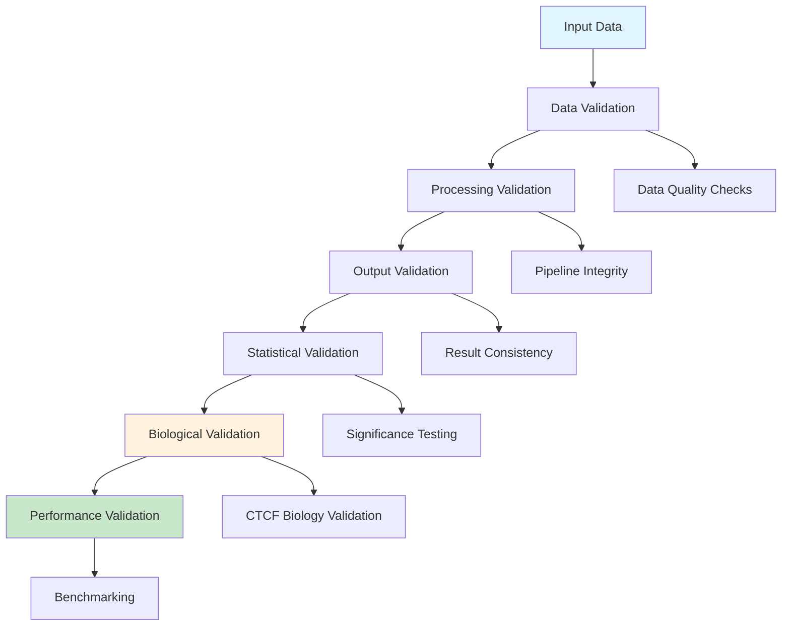

# Testing & Validation

> **🧪 Quality Assurance and Benchmarking Procedures**  
> Comprehensive guide to testing, validating, and benchmarking the CTCF PWM Testing Pipeline for research reliability and reproducibility.

## 🎯 Validation Philosophy

The pipeline implements a **multi-layered validation framework** ensuring:
- **Scientific Validity** - Biologically meaningful results
- **Statistical Rigor** - Proper hypothesis testing and significance
- **Reproducibility** - Consistent results across runs
- **Performance Reliability** - Robust operation under various conditions

## 🏗️ Validation Framework Architecture



## 📊 Validation Levels

### Level 1: Data Validation

**Input Data Quality Assessment**

```bash
# Basic data validation
Rscript scripts/validate_input_data.R \
  --input data/sequences.fa \
  --report results/data_validation.html
```

**Validation Checks:**
- **Sequence Format** - Valid FASTA format
- **Sequence Length** - Within acceptable ranges
- **Sequence Quality** - No ambiguous nucleotides excess
- **Sequence Complexity** - Avoid low-complexity regions
- **Duplicate Detection** - Identify redundant sequences

**Quality Metrics:**
```r
# Data quality assessment
assess_data_quality <- function(sequences) {
  return(list(
    total_sequences = length(sequences),
    length_distribution = analyze_length_distribution(sequences),
    gc_content = analyze_gc_content(sequences),
    complexity_scores = calculate_complexity(sequences),
    duplicate_rate = calculate_duplicate_rate(sequences),
    quality_grade = overall_quality_grade(sequences)
  ))
}
```

### Level 2: Processing Validation

**Pipeline Integrity Testing**

**Alignment Validation:**
```bash
# Test alignment quality improvement
Rscript scripts/test_alignment_quality.R \
  --sequences data/sequences.fa \
  --methods center,consensus,integrated \
  --output results/alignment_validation.html
```

**Validation Metrics:**
- **Information Content Improvement** - Pre vs. post alignment
- **Pattern Recognition** - Motif pattern detection
- **Alignment Stability** - Consistency across runs
- **Convergence Analysis** - Iterative alignment convergence

**PWM Construction Validation:**
```bash
# Test PWM construction robustness
Rscript scripts/test_pwm_construction.R \
  --sequences data/aligned_sequences.fa \
  --bootstrap-runs 100 \
  --output results/pwm_validation.html
```

### Level 3: Output Validation

**Result Consistency Testing**

**Cross-Validation Framework:**
```r
# K-fold cross-validation
perform_cross_validation <- function(sequences, k = 5) {
  folds <- create_folds(sequences, k)
  results <- list()
  
  for (i in 1:k) {
    train_data <- sequences[-folds[[i]]]
    test_data <- sequences[folds[[i]]]
    
    # Build PWM on training data
    pwm <- build_pwm_robust(train_data)
    
    # Test on validation data
    performance <- evaluate_pwm(pwm, test_data)
    
    results[[i]] <- performance
  }
  
  return(aggregate_cv_results(results))
}
```

**Chromosome Split Validation:**
```bash
# Chromosome-based validation
Rscript scripts/chromosome_split_validation.R \
  --sequences data/sequences.fa \
  --train-chromosomes "1,2,3,4,5,6,7,8,9,10,11,12,13,14,15" \
  --test-chromosomes "16,17,18,19,20,21,22,X,Y" \
  --output results/chromosome_validation.html
```

### Level 4: Statistical Validation

**Hypothesis Testing Framework**

**Null Model Comparison:**
```r
# Generate null models for comparison
generate_null_models <- function(sequences, n_models = 1000) {
  null_models <- list()
  
  for (i in 1:n_models) {
    # Generate random sequences with same composition
    null_sequences <- generate_random_sequences(sequences)
    null_pwm <- build_pwm_robust(null_sequences)
    null_models[[i]] <- null_pwm
  }
  
  return(null_models)
}

# Statistical significance testing
test_statistical_significance <- function(observed_pwm, null_models) {
  observed_ic <- sum(observed_pwm$information_content)
  null_ics <- sapply(null_models, function(x) sum(x$information_content))
  
  # Calculate p-value
  p_value <- sum(null_ics >= observed_ic) / length(null_ics)
  
  # Effect size (Cohen's d)
  effect_size <- (observed_ic - mean(null_ics)) / sd(null_ics)
  
  return(list(
    p_value = p_value,
    effect_size = effect_size,
    significance = p_value < 0.01
  ))
}
```

**Bootstrap Confidence Intervals:**
```bash
# Bootstrap validation
Rscript scripts/bootstrap_validation.R \
  --sequences data/aligned_sequences.fa \
  --bootstrap-samples 1000 \
  --confidence-level 0.95 \
  --output results/bootstrap_validation.html
```

### Level 5: Biological Validation

**CTCF-Specific Validation**

**Motif Pattern Validation:**
```r
# Validate against known CTCF motif patterns
validate_ctcf_pattern <- function(pwm) {
  # Expected CTCF consensus: CCGCGNGGNGGCAG
  expected_pattern <- "CCGCGNGGNGGCAG"
  
  # Generate consensus from PWM
  observed_consensus <- generate_consensus(pwm)
  
  # Calculate pattern similarity
  similarity <- calculate_pattern_similarity(observed_consensus, expected_pattern)
  
  # Validate zinc finger binding positions
  zf_positions <- validate_zinc_finger_positions(pwm)
  
  return(list(
    pattern_similarity = similarity,
    zinc_finger_validation = zf_positions,
    biological_relevance = assess_biological_relevance(pwm)
  ))
}
```

**Information Content Profile Validation:**
```r
# Validate IC profile against expected CTCF pattern
validate_ic_profile <- function(pwm) {
  # Expected CTCF IC profile (approximate)
  expected_ic <- c(1.8, 1.6, 1.9, 1.7, 0.8, 0.4, 0.9, 1.5, 1.4, 0.6, 1.2, 1.3, 1.8, 1.6, 1.4)
  observed_ic <- pwm$information_content
  
  # Calculate correlation
  correlation <- cor(observed_ic, expected_ic[1:length(observed_ic)])
  
  # Identify conserved positions
  conserved_observed <- which(observed_ic > 1.0)
  conserved_expected <- which(expected_ic > 1.0)
  
  # Calculate overlap
  overlap <- length(intersect(conserved_observed, conserved_expected)) / 
             length(union(conserved_observed, conserved_expected))
  
  return(list(
    ic_correlation = correlation,
    conserved_position_overlap = overlap,
    biological_validity = correlation > 0.7 && overlap > 0.6
  ))
}
```

### Level 6: Performance Validation

**Benchmarking and Performance Testing**

**Execution Time Benchmarking:**
```bash
# Performance benchmarking
Rscript scripts/benchmark_performance.R \
  --dataset-sizes "100,500,1000,5000,10000" \
  --methods "center,consensus,integrated" \
  --repetitions 10 \
  --output results/performance_benchmark.html
```

**Memory Usage Testing:**
```r
# Memory profiling
profile_memory_usage <- function(sequences) {
  # Start memory profiling
  Rprof(memory.profiling = TRUE)
  
  # Run pipeline
  result <- build_pwm_robust(sequences)
  
  # Stop profiling
  Rprof(NULL)
  
  # Analyze memory usage
  memory_profile <- summaryRprof(memory = "both")
  
  return(list(
    result = result,
    memory_usage = memory_profile,
    peak_memory = max(memory_profile$by.total$mem.total)
  ))
}
```

## 🧪 Testing Protocols

### Automated Testing Suite

**Unit Tests:**
```r
# Test individual functions
test_build_pwm_robust <- function() {
  # Test with known input
  test_sequences <- load_test_sequences()
  expected_ic <- 15.2  # Known expected value
  
  result <- build_pwm_robust(test_sequences)
  
  # Assertions
  stopifnot(abs(sum(result$information_content) - expected_ic) < 0.1)
  stopifnot(result$quality_grade == "EXCELLENT")
  stopifnot(nrow(result$pwm) == 4)  # A, C, G, T
}
```

**Integration Tests:**
```bash
# Full pipeline integration test
./tests/run_integration_tests.sh
```

**Regression Tests:**
```bash
# Test against known good results
Rscript tests/regression_test.R \
  --reference-results tests/reference_outputs/ \
  --current-results results/ \
  --tolerance 0.01
```

### Manual Testing Procedures

**Quality Control Checklist:**
- [ ] Input data passes all validation checks
- [ ] Alignment shows IC improvement >5x
- [ ] PWM total IC >8.0 bits (minimum acceptable)
- [ ] Conserved positions ≥3
- [ ] Statistical significance p <0.01
- [ ] CTCF pattern similarity >0.7
- [ ] Cross-validation consistency >0.8

**Visual Inspection Protocol:**
1. **Sequence Logo** - Check for recognizable CTCF pattern
2. **IC Profile** - Verify high IC at expected positions
3. **Alignment Quality** - Visual inspection of alignment
4. **Conservation Pattern** - Check zinc finger correspondence

## 📈 Performance Benchmarks

### Reference Performance Metrics

**Hardware Reference:** 8-core CPU, 16GB RAM, SSD storage

| **Dataset Size** | **Method** | **Processing Time** | **Memory Usage** | **Quality (IC)** |
|------------------|------------|-------------------|------------------|------------------|
| 100 sequences    | Center     | 15 seconds        | 512 MB          | 12.4 bits       |
| 100 sequences    | Consensus  | 25 seconds        | 768 MB          | 14.2 bits       |
| 100 sequences    | Integrated | 35 seconds        | 1.2 GB          | 16.8 bits       |
| 1,000 sequences  | Center     | 45 seconds        | 1.5 GB          | 14.8 bits       |
| 1,000 sequences  | Consensus  | 78 seconds        | 2.1 GB          | 17.2 bits       |
| 1,000 sequences  | Integrated | 95 seconds        | 2.8 GB          | 19.6 bits       |
| 10,000 sequences | Center     | 240 seconds       | 4.2 GB          | 16.1 bits       |
| 10,000 sequences | Consensus  | 420 seconds       | 6.8 GB          | 18.9 bits       |
| 10,000 sequences | Integrated | 580 seconds       | 8.5 GB          | 21.3 bits       |

### Quality Benchmarks

**Expected Quality Ranges:**
- **Excellent** (>16 bits): Publication quality, suitable for drug discovery
- **Good** (12-16 bits): Research quality, suitable for most applications
- **Acceptable** (8-12 bits): Minimum quality for basic analysis
- **Poor** (<8 bits): Requires improvement or different approach

## 🔧 Validation Scripts

### Comprehensive Validation Script

```bash
#!/bin/bash
# comprehensive_validation.sh - Complete validation suite

SEQUENCES="data/test_sequences.fa"
OUTPUT_DIR="results/validation"
mkdir -p "$OUTPUT_DIR"

echo "Starting comprehensive validation..."

# 1. Data validation
echo "1. Validating input data..."
Rscript scripts/validate_input_data.R \
  --input "$SEQUENCES" \
  --output "$OUTPUT_DIR/data_validation.html"

# 2. Alignment validation
echo "2. Testing alignment methods..."
Rscript scripts/test_alignment_quality.R \
  --sequences "$SEQUENCES" \
  --methods "center,consensus,integrated" \
  --output "$OUTPUT_DIR/alignment_validation.html"

# 3. Cross-validation
echo "3. Performing cross-validation..."
Rscript scripts/cross_validation.R \
  --sequences "$SEQUENCES" \
  --folds 5 \
  --output "$OUTPUT_DIR/cross_validation.html"

# 4. Statistical validation
echo "4. Statistical significance testing..."
Rscript scripts/statistical_validation.R \
  --sequences "$SEQUENCES" \
  --null-models 1000 \
  --output "$OUTPUT_DIR/statistical_validation.html"

# 5. Biological validation
echo "5. Biological pattern validation..."
Rscript scripts/biological_validation.R \
  --sequences "$SEQUENCES" \
  --output "$OUTPUT_DIR/biological_validation.html"

# 6. Performance benchmarking
echo "6. Performance benchmarking..."
Rscript scripts/benchmark_performance.R \
  --sequences "$SEQUENCES" \
  --output "$OUTPUT_DIR/performance_benchmark.html"

# 7. Generate summary report
echo "7. Generating validation summary..."
Rscript scripts/generate_validation_summary.R \
  --validation-dir "$OUTPUT_DIR" \
  --output "$OUTPUT_DIR/validation_summary.html"

echo "Validation complete. Results in: $OUTPUT_DIR"
```

### Quick Validation Script

```bash
#!/bin/bash
# quick_validation.sh - Essential validation checks

SEQUENCES="$1"
if [ -z "$SEQUENCES" ]; then
  echo "Usage: $0 <sequences.fa>"
  exit 1
fi

echo "Quick validation of: $SEQUENCES"

# Build PWM
echo "Building PWM..."
PWM_FILE="temp_pwm_$$.meme"
Rscript scripts/build_pwm_robust.R \
  --sequences "$SEQUENCES" \
  --output "$PWM_FILE" \
  --quiet

# Quick quality check
echo "Quality assessment:"
Rscript scripts/assess_pwm_quality.R \
  --pwm "$PWM_FILE" \
  --brief

# Cleanup
rm -f "$PWM_FILE"
```

## 🎯 Validation Reporting

### Validation Report Template

```r
# Generate comprehensive validation report
generate_validation_report <- function(validation_results, output_file) {
  report <- list(
    summary = validation_results$summary,
    data_quality = validation_results$data_quality,
    processing_quality = validation_results$processing_quality,
    statistical_validation = validation_results$statistical_validation,
    biological_validation = validation_results$biological_validation,
    performance_metrics = validation_results$performance_metrics,
    recommendations = generate_recommendations(validation_results)
  )
  
  # Generate HTML report
  render_html_report(report, output_file)
  
  return(report)
}
```

### Validation Certificates

**Quality Certificate Generation:**
```r
# Generate quality certificate for validated PWMs
generate_quality_certificate <- function(pwm, validation_results) {
  certificate <- list(
    pwm_id = generate_pwm_id(pwm),
    validation_date = Sys.Date(),
    quality_grade = determine_quality_grade(validation_results),
    key_metrics = extract_key_metrics(validation_results),
    validation_passes = count_validation_passes(validation_results),
    certification_level = determine_certification_level(validation_results),
    signature = generate_validation_signature(validation_results)
  )
  
  return(certificate)
}
```

## 🔍 Troubleshooting Validation Issues

### Common Validation Failures

**Low Information Content:**
```
Issue: Total IC < 8.0 bits
Possible Causes:
1. Poor sequence alignment
2. Low-quality input data
3. Insufficient sequence diversity
4. Incorrect parameters

Solutions:
1. Try different alignment methods
2. Improve data quality filtering
3. Increase dataset size
4. Adjust pseudocount parameters
```

**Statistical Significance Failure:**
```
Issue: p-value > 0.01
Possible Causes:
1. Small effect size
2. High background noise
3. Insufficient sample size
4. Poor alignment quality

Solutions:
1. Improve alignment quality
2. Filter noisy sequences
3. Increase sample size
4. Use more stringent quality thresholds
```

**Biological Pattern Mismatch:**
```
Issue: Low CTCF pattern similarity
Possible Causes:
1. Non-CTCF binding sites in data
2. Poor alignment
3. Mixed binding modes
4. Low-affinity sites

Solutions:
1. Validate input data source
2. Improve alignment methods
3. Filter by binding affinity
4. Use CTCF-specific preprocessing
```

---

## 📖 Next Reading

- **[Results Analysis](12-results-analysis.md)** - Understanding validation outputs
- **[Troubleshooting](14-troubleshooting.md)** - Solving validation issues
- **[Extending the Pipeline](13-extending-pipeline.md)** - Adding custom validation methods

---

*This comprehensive validation framework ensures your CTCF PWM results are scientifically sound, statistically significant, and suitable for your research applications.*
