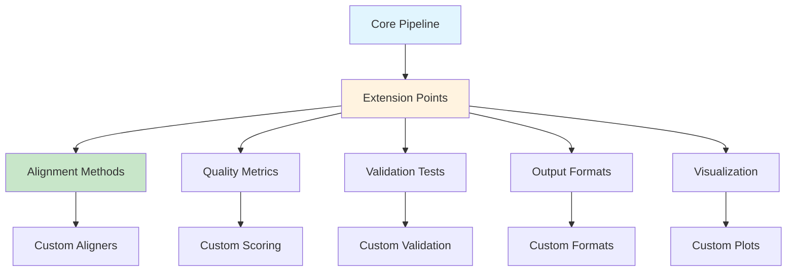

# Extending the Pipeline

> **🛠️ Adding New Methods, Features, and Customizations**  
> Comprehensive guide to extending and customizing the CTCF PWM Testing Pipeline for specialized research needs and novel methodologies.

## 🎯 Extension Philosophy

The pipeline is designed with **modularity and extensibility** as core principles:
- **Plugin Architecture** - Easy addition of new methods
- **Clear Interfaces** - Well-defined input/output contracts
- **Configuration-Driven** - Minimal code changes for new features
- **Backward Compatibility** - Extensions don't break existing functionality

## 🏗️ Extension Architecture



## 🔧 Extension Types

### 1. Alignment Method Extensions

**Adding New Alignment Algorithms**

**Create Custom Aligner:**
```r
# File: scripts/extensions/custom_alignment_method.R

# Custom alignment function interface
custom_alignment_method <- function(sequences, config = list()) {
  # Your custom alignment algorithm here
  
  # Example: Machine learning-based alignment
  ml_alignment <- function(sequences) {
    # Load pre-trained model
    model <- load_alignment_model(config$model_path)
    
    # Predict optimal alignment
    aligned_sequences <- predict_alignment(model, sequences)
    
    return(aligned_sequences)
  }
  
  # Required return format
  return(list(
    aligned_sequences = ml_alignment(sequences),
    alignment_quality = calculate_alignment_quality(sequences),
    metadata = list(
      method = "machine_learning",
      parameters = config,
      processing_time = system.time(ml_alignment(sequences))
    )
  ))
}

# Register the new method
register_alignment_method("ml_alignment", custom_alignment_method)
```

**Integration Pattern:**
```r
# File: scripts/advanced_alignment.R (modification)

# Add to existing alignment methods
align_sequences <- function(sequences, method = "integrated", config = list()) {
  switch(method,
    "center" = center_based_alignment(sequences, config),
    "consensus" = consensus_based_alignment(sequences, config),
    "integrated" = integrated_alignment(sequences, config),
    "ml_alignment" = custom_alignment_method(sequences, config),  # New method
    stop("Unknown alignment method: ", method)
  )
}
```

**Configuration Support:**
```yaml
# config/extensions.yml
alignment:
  methods:
    ml_alignment:
      enabled: true
      model_path: "models/alignment_model.rds"
      learning_rate: 0.01
      max_iterations: 100
      validation_split: 0.2
```

### 2. Quality Metric Extensions

**Custom Quality Assessment Functions**

**Biological Relevance Scoring:**
```r
# File: scripts/extensions/biological_quality_metrics.R

# Custom biological quality assessment
assess_biological_quality <- function(pwm, sequences, config = list()) {
  
  # 1. Protein-DNA interaction scoring
  interaction_score <- function(pwm) {
    # Calculate based on known protein-DNA interaction energies
    binding_energies <- calculate_binding_energies(pwm)
    return(mean(binding_energies))
  }
  
  # 2. Evolutionary conservation scoring
  conservation_score <- function(pwm) {
    # Compare against known CTCF sites across species
    species_comparison <- compare_across_species(pwm, config$species_data)
    return(species_comparison$conservation_index)
  }
  
  # 3. Structural compatibility scoring
  structural_score <- function(pwm) {
    # Assess compatibility with CTCF protein structure
    structure_compatibility <- assess_structure_compatibility(pwm, config$structure_data)
    return(structure_compatibility$compatibility_score)
  }
  
  # Combine scores
  biological_quality <- list(
    interaction_score = interaction_score(pwm),
    conservation_score = conservation_score(pwm),
    structural_score = structural_score(pwm),
    combined_biological_score = weighted_combine_scores(
      interaction_score(pwm),
      conservation_score(pwm), 
      structural_score(pwm),
      weights = config$score_weights
    )
  )
  
  return(biological_quality)
}

# Register the custom quality metric
register_quality_metric("biological_quality", assess_biological_quality)
```

**Machine Learning Quality Prediction:**
```r
# File: scripts/extensions/ml_quality_metrics.R

# ML-based quality prediction
predict_pwm_quality <- function(pwm, sequences, config = list()) {
  
  # Extract features for ML model
  features <- extract_pwm_features(pwm)
  sequence_features <- extract_sequence_features(sequences)
  combined_features <- cbind(features, sequence_features)
  
  # Load pre-trained quality prediction model
  quality_model <- load_quality_model(config$model_path)
  
  # Predict quality scores
  predicted_quality <- predict(quality_model, combined_features)
  
  # Calculate confidence intervals
  confidence_intervals <- calculate_prediction_confidence(
    quality_model, combined_features, config$confidence_level
  )
  
  return(list(
    predicted_quality = predicted_quality,
    confidence_lower = confidence_intervals$lower,
    confidence_upper = confidence_intervals$upper,
    feature_importance = get_feature_importance(quality_model),
    model_performance = config$model_performance_metrics
  ))
}
```

### 3. Validation Method Extensions

**Custom Statistical Tests**

**Bayesian Validation Framework:**
```r
# File: scripts/extensions/bayesian_validation.R

# Bayesian PWM validation
bayesian_pwm_validation <- function(pwm, sequences, config = list()) {
  
  # Set up Bayesian model
  setup_bayesian_model <- function() {
    # Define priors for PWM parameters
    priors <- list(
      ic_prior = config$ic_prior,
      conservation_prior = config$conservation_prior,
      pattern_prior = config$pattern_prior
    )
    
    return(priors)
  }
  
  # MCMC sampling for posterior distributions
  mcmc_sampling <- function(pwm, priors) {
    # Run MCMC chains
    mcmc_results <- run_mcmc_chains(
      pwm, priors, 
      n_chains = config$n_chains,
      n_iterations = config$n_iterations,
      burn_in = config$burn_in
    )
    
    return(mcmc_results)
  }
  
  # Posterior analysis
  posterior_analysis <- function(mcmc_results) {
    # Calculate posterior statistics
    posterior_stats <- list(
      posterior_mean = calculate_posterior_mean(mcmc_results),
      credible_intervals = calculate_credible_intervals(mcmc_results, config$credible_level),
      bayes_factor = calculate_bayes_factor(mcmc_results),
      model_probability = calculate_model_probability(mcmc_results)
    )
    
    return(posterior_stats)
  }
  
  # Execute Bayesian validation
  priors <- setup_bayesian_model()
  mcmc_results <- mcmc_sampling(pwm, priors)
  validation_results <- posterior_analysis(mcmc_results)
  
  return(validation_results)
}
```

**Deep Learning Validation:**
```r
# File: scripts/extensions/deep_learning_validation.R

# Neural network-based PWM validation
neural_network_validation <- function(pwm, sequences, config = list()) {
  
  # Load pre-trained validation network
  validation_network <- load_validation_network(config$network_path)
  
  # Prepare input data
  network_input <- prepare_network_input(pwm, sequences)
  
  # Run validation through network
  validation_scores <- predict_validation_scores(validation_network, network_input)
  
  # Interpret network outputs
  validation_interpretation <- interpret_network_outputs(
    validation_scores, 
    config$interpretation_thresholds
  )
  
  return(list(
    network_scores = validation_scores,
    validation_pass = validation_interpretation$pass,
    confidence_score = validation_interpretation$confidence,
    failure_reasons = validation_interpretation$failure_reasons,
    network_metadata = get_network_metadata(validation_network)
  ))
}
```

### 4. Output Format Extensions

**Custom Output Formats**

**Specialized Research Format:**
```r
# File: scripts/extensions/custom_output_formats.R

# Custom research-specific format
export_research_format <- function(pwm, validation_results, config = list()) {
  
  # Create comprehensive research export
  research_export <- list(
    
    # Core PWM data
    pwm_matrix = pwm$probability_matrix,
    information_content = pwm$information_content,
    
    # Extended metadata
    experimental_conditions = config$experimental_metadata,
    computational_parameters = config$computational_parameters,
    quality_assessment = validation_results$quality_metrics,
    
    # Statistical validation
    statistical_tests = validation_results$statistical_tests,
    confidence_intervals = validation_results$confidence_intervals,
    cross_validation_results = validation_results$cross_validation,
    
    # Biological interpretation
    ctcf_pattern_analysis = validation_results$ctcf_analysis,
    zinc_finger_correspondence = validation_results$zf_analysis,
    evolutionary_conservation = validation_results$evolution_analysis,
    
    # Reproducibility information
    software_versions = get_software_versions(),
    random_seeds = config$random_seeds,
    processing_timestamp = Sys.time(),
    
    # Custom analysis results
    custom_metrics = validation_results$custom_metrics
  )
  
  # Export to custom JSON format
  export_json(research_export, config$output_file)
  
  # Also create human-readable summary
  create_research_summary(research_export, paste0(config$output_file, ".summary.txt"))
  
  return(research_export)
}

# Register custom format
register_output_format("research", export_research_format)
```

**Bioinformatics Database Format:**
```r
# File: scripts/extensions/database_export.R

# Export for bioinformatics databases
export_database_format <- function(pwm, metadata, config = list()) {
  
  # Prepare database entry
  database_entry <- list(
    
    # Standard database fields
    motif_id = generate_motif_id(pwm, config),
    motif_name = config$motif_name,
    organism = config$organism,
    data_source = config$data_source,
    
    # PWM in multiple standard formats
    pwm_meme = convert_to_meme(pwm),
    pwm_jaspar = convert_to_jaspar(pwm),
    pwm_transfac = convert_to_transfac(pwm),
    
    # Quality annotations
    quality_grade = metadata$quality_grade,
    confidence_score = metadata$confidence_score,
    validation_status = metadata$validation_status,
    
    # Biological annotations
    protein_family = "CTCF",
    binding_domain = "Zinc finger",
    functional_role = "Chromatin organization",
    
    # Database-specific metadata
    submission_date = Sys.Date(),
    version = config$version,
    references = config$references,
    
    # Custom tags for searchability
    tags = generate_database_tags(pwm, metadata, config)
  )
  
  return(database_entry)
}
```

### 5. Visualization Extensions

**Custom Visualization Methods**

**Interactive Visualizations:**
```r
# File: scripts/extensions/interactive_visualizations.R

# Create interactive PWM visualizations
create_interactive_pwm_viz <- function(pwm, validation_results, config = list()) {
  
  # Interactive sequence logo
  interactive_logo <- create_interactive_logo(
    pwm, 
    height_encoding = config$height_encoding,
    color_scheme = config$color_scheme,
    interactive_features = config$interactive_features
  )
  
  # Interactive information content profile
  interactive_ic_plot <- create_interactive_ic_plot(
    pwm$information_content,
    position_annotations = config$position_annotations,
    threshold_lines = config$threshold_lines,
    zoom_features = config$zoom_features
  )
  
  # Interactive quality dashboard
  quality_dashboard <- create_quality_dashboard(
    validation_results,
    layout = config$dashboard_layout,
    update_frequency = config$update_frequency
  )
  
  # Combine into interactive report
  interactive_report <- combine_interactive_elements(
    list(interactive_logo, interactive_ic_plot, quality_dashboard),
    config$report_template
  )
  
  # Export as HTML with embedded JavaScript
  export_interactive_html(interactive_report, config$output_file)
  
  return(interactive_report)
}
```

**3D Protein Structure Visualization:**
```r
# File: scripts/extensions/protein_structure_viz.R

# Visualize PWM in context of 3D protein structure
create_3d_structure_visualization <- function(pwm, config = list()) {
  
  # Load CTCF protein structure
  protein_structure <- load_protein_structure(config$structure_file)
  
  # Map PWM positions to zinc finger domains
  zf_mapping <- map_pwm_to_zinc_fingers(pwm, protein_structure)
  
  # Create 3D visualization
  structure_viz <- create_3d_protein_viz(
    protein_structure,
    pwm_mapping = zf_mapping,
    color_by_ic = TRUE,
    interaction_highlights = config$highlight_interactions
  )
  
  # Add DNA binding visualization
  dna_binding_viz <- add_dna_binding_visualization(
    structure_viz,
    pwm,
    binding_mode = config$binding_mode
  )
  
  # Export as interactive 3D model
  export_3d_model(dna_binding_viz, config$output_file)
  
  return(dna_binding_viz)
}
```

## 🧩 Plugin Development Framework

### Plugin Template

**Basic Plugin Structure:**
```r
# File: scripts/extensions/plugin_template.R

# Plugin metadata
PLUGIN_INFO <- list(
  name = "example_plugin",
  version = "1.0.0",
  description = "Example plugin for demonstration",
  author = "Your Name",
  dependencies = c("required_package1", "required_package2"),
  pipeline_version_min = "2.0.0"
)

# Plugin initialization
initialize_plugin <- function(config = list()) {
  # Check dependencies
  check_dependencies(PLUGIN_INFO$dependencies)
  
  # Initialize plugin-specific resources
  plugin_resources <- setup_plugin_resources(config)
  
  # Register plugin components
  register_plugin_components()
  
  return(plugin_resources)
}

# Plugin main function
execute_plugin <- function(input_data, config = list()) {
  # Validate input
  validate_plugin_input(input_data)
  
  # Execute plugin logic
  result <- process_plugin_logic(input_data, config)
  
  # Validate output
  validate_plugin_output(result)
  
  return(result)
}

# Plugin cleanup
cleanup_plugin <- function() {
  # Clean up resources
  cleanup_plugin_resources()
  
  # Unregister components
  unregister_plugin_components()
}

# Export plugin interface
export_plugin_interface <- function() {
  return(list(
    info = PLUGIN_INFO,
    initialize = initialize_plugin,
    execute = execute_plugin,
    cleanup = cleanup_plugin
  ))
}
```

### Plugin Management System

**Plugin Registry:**
```r
# File: scripts/core/plugin_manager.R

# Global plugin registry
PLUGIN_REGISTRY <- new.env()

# Register plugin
register_plugin <- function(plugin_name, plugin_interface) {
  # Validate plugin interface
  validate_plugin_interface(plugin_interface)
  
  # Check version compatibility
  check_version_compatibility(plugin_interface$info)
  
  # Register plugin
  PLUGIN_REGISTRY[[plugin_name]] <- plugin_interface
  
  cat("Plugin registered:", plugin_name, "\n")
}

# Load plugin
load_plugin <- function(plugin_path) {
  # Source plugin file
  source(plugin_path)
  
  # Get plugin interface
  plugin_interface <- export_plugin_interface()
  
  # Register plugin
  register_plugin(plugin_interface$info$name, plugin_interface)
  
  return(plugin_interface$info$name)
}

# Execute plugin
execute_plugin <- function(plugin_name, input_data, config = list()) {
  if (!exists(plugin_name, envir = PLUGIN_REGISTRY)) {
    stop("Plugin not found: ", plugin_name)
  }
  
  plugin <- get(plugin_name, envir = PLUGIN_REGISTRY)
  return(plugin$execute(input_data, config))
}
```

## 🔧 Configuration Extensions

### Dynamic Configuration System

**Extensible Configuration Schema:**
```yaml
# config/extensions_schema.yml
extensions:
  alignment_methods:
    - name: string
      enabled: boolean
      parameters: object
      
  quality_metrics:
    - name: string
      weight: number
      threshold: number
      parameters: object
      
  validation_tests:
    - name: string
      required: boolean
      parameters: object
      
  output_formats:
    - name: string
      enabled: boolean
      parameters: object
      
  visualizations:
    - name: string
      enabled: boolean
      parameters: object

# Custom extension configurations
custom_extensions:
  my_alignment_method:
    enabled: true
    model_path: "models/my_model.rds"
    parameters:
      learning_rate: 0.01
      max_iterations: 100
      
  my_quality_metric:
    weight: 0.3
    threshold: 0.8
    parameters:
      use_deep_learning: true
      network_architecture: "cnn"
```

### Runtime Configuration Updates

**Dynamic Configuration Loading:**
```r
# File: scripts/core/dynamic_config.R

# Load configuration with extensions
load_extended_config <- function(config_file, extensions_dir = "scripts/extensions/") {
  # Load base configuration
  base_config <- load_base_config(config_file)
  
  # Discover available extensions
  available_extensions <- discover_extensions(extensions_dir)
  
  # Load extension configurations
  extension_configs <- load_extension_configs(available_extensions)
  
  # Merge configurations
  extended_config <- merge_configurations(base_config, extension_configs)
  
  # Validate extended configuration
  validate_extended_config(extended_config)
  
  return(extended_config)
}

# Update configuration at runtime
update_config_runtime <- function(config, updates) {
  # Validate updates
  validate_config_updates(updates)
  
  # Apply updates
  updated_config <- apply_config_updates(config, updates)
  
  # Reload affected components
  reload_affected_components(updated_config, config)
  
  return(updated_config)
}
```

## 🚀 Deployment and Distribution

### Extension Package Structure

**Recommended Directory Structure:**
```
my_ctcf_extension/
├── DESCRIPTION              # Package metadata
├── NAMESPACE               # Package namespace
├── R/                      # R source files
│   ├── alignment_methods.R
│   ├── quality_metrics.R
│   └── visualization.R
├── inst/
│   ├── config/            # Default configurations
│   ├── models/            # Pre-trained models
│   └── examples/          # Usage examples
├── tests/                 # Unit tests
│   ├── testthat/
│   └── test_all.R
├── vignettes/             # Documentation
│   └── extension_guide.Rmd
├── data/                  # Example data
└── README.md              # Extension documentation
```

### Extension Installation

**Installation Script:**
```r
# File: install_extension.R

# Install CTCF pipeline extension
install_ctcf_extension <- function(extension_path, target_dir = "scripts/extensions/") {
  
  # Validate extension package
  validate_extension_package(extension_path)
  
  # Check dependencies
  check_extension_dependencies(extension_path)
  
  # Install extension files
  install_extension_files(extension_path, target_dir)
  
  # Register extension
  register_extension(extension_path)
  
  # Run post-installation setup
  run_post_install_setup(extension_path)
  
  cat("Extension installed successfully!\n")
}

# Uninstall extension
uninstall_ctcf_extension <- function(extension_name) {
  # Unregister extension
  unregister_extension(extension_name)
  
  # Remove extension files
  remove_extension_files(extension_name)
  
  # Clean up resources
  cleanup_extension_resources(extension_name)
  
  cat("Extension uninstalled successfully!\n")
}
```

## 📚 Extension Examples

### Example 1: Deep Learning Alignment

**Complete Implementation:**
```r
# File: scripts/extensions/deep_learning_alignment.R

# Deep learning-based sequence alignment
dl_alignment <- function(sequences, config = list()) {
  
  # Load pre-trained alignment model
  model_path <- config$model_path %||% "models/dl_alignment_model.h5"
  alignment_model <- load_dl_model(model_path)
  
  # Preprocess sequences for neural network
  preprocessed_seqs <- preprocess_sequences_for_dl(sequences)
  
  # Predict optimal alignment
  alignment_predictions <- predict_alignment(alignment_model, preprocessed_seqs)
  
  # Post-process predictions to get aligned sequences
  aligned_sequences <- postprocess_alignment_predictions(
    sequences, 
    alignment_predictions,
    config$postprocess_params
  )
  
  # Calculate alignment quality metrics
  quality_metrics <- calculate_dl_alignment_quality(
    sequences, 
    aligned_sequences,
    alignment_model
  )
  
  return(list(
    aligned_sequences = aligned_sequences,
    alignment_quality = quality_metrics,
    model_metadata = get_model_metadata(alignment_model),
    processing_time = quality_metrics$processing_time
  ))
}

# Register the method
register_alignment_method("deep_learning", dl_alignment)
```

### Example 2: Bayesian Quality Assessment

**Implementation with Stan/JAGS:**
```r
# File: scripts/extensions/bayesian_quality.R

# Bayesian PWM quality assessment
bayesian_quality_assessment <- function(pwm, sequences, config = list()) {
  
  # Set up Bayesian model in Stan
  stan_model_code <- "
    data {
      int<lower=0> N;  // number of sequences
      int<lower=0> L;  // sequence length
      int<lower=0> A[N,L];  // sequence data (encoded)
    }
    parameters {
      simplex[4] theta[L];  // position-specific probabilities
    }
    model {
      for (i in 1:N) {
        for (j in 1:L) {
          A[i,j] ~ categorical(theta[j]);
        }
      }
    }
  "
  
  # Prepare data for Stan
  stan_data <- prepare_stan_data(sequences)
  
  # Run MCMC sampling
  mcmc_results <- run_stan_mcmc(stan_model_code, stan_data, config)
  
  # Extract posterior distributions
  posterior_stats <- extract_posterior_statistics(mcmc_results)
  
  # Calculate Bayesian quality metrics
  bayesian_metrics <- list(
    posterior_ic = calculate_posterior_ic(posterior_stats),
    credible_intervals = calculate_credible_intervals(posterior_stats),
    bayes_factor = calculate_bayes_factor(mcmc_results),
    model_evidence = calculate_model_evidence(mcmc_results)
  )
  
  return(bayesian_metrics)
}
```

---

## 📖 Next Reading

- **[API Reference](15-api-reference.md)** - Technical specifications for extensions
- **[Troubleshooting](14-troubleshooting.md)** - Common extension development issues
- **[Scripts Reference](08-scripts-reference.md)** - Understanding core pipeline components

---

*This comprehensive extension guide enables you to customize and enhance the CTCF PWM Testing Pipeline for any specialized research application or novel methodology.*
