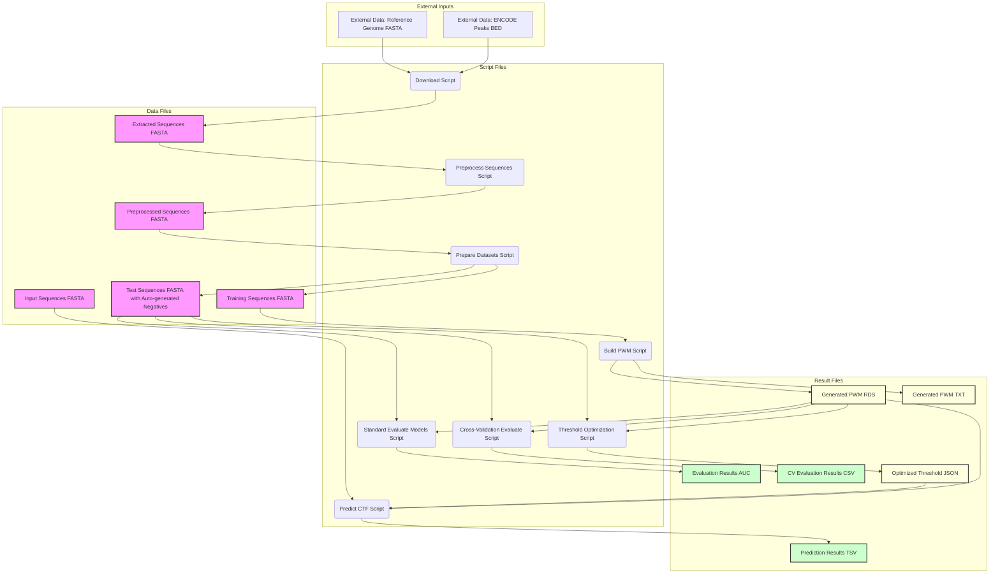

# CTCF Binding Site Prediction Pipeline

## Project Objective

Predict potential binding sites for the CTCF (CCCTC-binding factor) transcription factor within DNA sequences. CTCF plays a crucial role in chromatin organization and gene expression regulation.

## Project Architecture

This project is structured as a pipeline that automates the process of downloading data, preparing datasets, building models, evaluating them, and making predictions. The pipeline consists of several scripts that can be executed sequentially to achieve the desired results.
The main components of the pipeline are as follows:

1. **Data Collection & Initial Extraction:** Download CTCF ChIP-seq peak data and extract sequences.
2. **Dataset Preparation:** Filter sequences, split into training and test sets, and generate negative examples.
3. **Build Sequence Model:** Create a Position Weight Matrix (PWM) from training sequences.
4. **Evaluate Models:** Assess model performance using ROC/AUC analysis.
5. **Threshold Optimization:** Determine the optimal score threshold for predictions.
6. **Prediction on New Sequences:** Scan new sequences using the PWM and identify potential binding sites.
7. **Prediction Results:** Output the predicted binding sites in a structured format.
<!-- 8. **Experimental Validation:** (Conceptual Step - Requires lab work) Verify predictions using techniques like Electrophoretic Mobility Shift Assay (EMSA). -->


## Prediction Pipeline Overview

0. **Sequence Preprocessing (NEW):**
   * Run the `scripts/preprocess_sequences.R` script on your FASTA files before starting the main pipeline.
   * This script provides comprehensive sequence preprocessing capabilities:
     * Length filtering and standardization
     * N-base handling (removal or substitution)
     * Low-complexity region detection and filtering
     * Repeat masking for homopolymers and simple repeats
   * Preprocessing is customizable via command-line arguments or a configuration file.
   * This step improves data quality and model performance by ensuring clean, consistent input sequences.

1. **Data Collection & Initial Extraction:**
   * Use the `scripts/download_data.sh` script to download example CTCF ChIP-seq peak data (BED format), a corresponding reference genome (either the full hg38 or just chr21), and extract raw sequences using `bedtools getfasta` into `data/extracted_sequences.fasta`.
   * The script supports demo mode (-d flag) for faster setup with only chr21, and force mode (-f flag) to re-download existing files.

2. **Dataset Preparation:**
   * Run the `scripts/prepare_datasets.R` script.
   * This reads `data/extracted_sequences.fasta`, filters sequences by length (optional), and splits them into `data/training_sequences.fasta` and `data/test_sequences.fasta`.
   * **NEW:** The script now **automatically generates negative examples** for the test set using one of several methods (shuffling, dinucleotide shuffling, or random sequence generation). This functionality can be configured via parameters in the script.

3. **Build Sequence Model:**
   * Run the `scripts/build_pwm.R` script using your prepared `data/training_sequences.fasta`.
   * This script calculates a Position Weight Matrix (PWM) representing the binding preferences.
   * The PWM is saved to `results/generated_pwm.rds`.

4. **Evaluate Models:**
   * Run the `scripts/evaluate_models.R` script.
   * This script uses your prepared and manually completed labeled test set (`data/test_sequences.fasta`) and the generated PWM(s) from the `results/` directory.
   * It calculates the Area Under the ROC Curve (AUC) to assess model performance.
   * **NEW:** For more robust evaluation, you can alternatively use the `scripts/evaluate_models_with_cv.R` script, which implements stratified k-fold cross-validation to provide more reliable performance estimates.

5. **Threshold Optimization (NEW):**
   * Run the `scripts/optimize_threshold.R` script to determine the optimal score threshold.
   * This script analyzes ROC curves to find the threshold that best balances sensitivity and specificity based on your chosen method.
   * Multiple optimization strategies are supported (Youden's index, balanced F1-score, etc.).
   * Results are saved as JSON for easy integration into your prediction workflow.

6. **Prediction on New Sequences:**
   * Run the `scripts/predict_ctcf.R` script, providing:
     * An input FASTA file containing sequences to scan.
     * A path for the output TSV file.
     * The path to a generated PWM model (`.rds` file).
     * A score threshold (can be determined by the optimization script).
   * The script loads the specified PWM.
   * It scans each sequence in the input FASTA using a sliding window.
   * Potential binding sites scoring above the specified threshold are identified.

7. **Prediction Results:**
   * The `predict_ctcf.R` script outputs a TSV file containing the predicted binding sites, including sequence name, start/end coordinates, the site sequence, and its score.

8. **Experimental Validation:** (Conceptual Step - Requires lab work)
   * Verify predictions using techniques like Electrophoretic Mobility Shift Assay (EMSA).

## Why Manual Negative Examples Are Required

1. **Data Source Limitation:**
   * The ChIP-seq peaks data from the download script only provides DNA regions where CTCF binds (positive cases).
   * These peaks represent experimentally validated binding sites, so they are intrinsically all positives.
   * The `prepare_datasets.R` script labels all sequences as `class=1` for this reason (see code in script).

2. **Evaluation Requirements:**
   * For proper model evaluation (ROC/AUC analysis), we need both positive AND negative examples.
   * Without negative examples, we cannot assess the model's ability to discriminate between true binding sites and false positives.
   * This is why manually adding negative examples is a critical step in this pipeline.

3. **Biological Complexity:**
   * True negative examples should represent regions where CTCF does not bind, despite potential sequence similarity.
   * Such knowledge requires biological context that automated scripts cannot easily generate.

## Best Practices for Negative Example Generation

1. **Random Genomic Sequences:**
   * Extract random regions from the genome that are not in ChIP-seq peaks.
   * Ensure these regions have similar length and GC content as positive examples.

2. **Shuffled Sequences:**
   * Create shuffled versions of positive sequences to maintain nucleotide composition while breaking binding motifs.
   * Example R code:

     ```R
     shuffle_sequence <- function(seq) {
       chars <- unlist(strsplit(seq, ""))
       paste0(sample(chars), collapse="")
     }
     ```

3. **Dinucleotide Shuffling:**
   * A more sophisticated approach that preserves dinucleotide frequencies.
   * Better preserves sequence complexity compared to simple shuffling.

4. **Genomic Background:**
   * Use sequences from genomic regions known to be depleted of CTCF binding (e.g., certain repetitive elements).

5. **Balanced Dataset:**
   * Ensure approximately equal numbers of positive and negative examples for unbiased evaluation.
   * Consider using the same number of negative examples as positive ones in your test set.

## Data Flow Diagram



## Project Structure

```text
/
├── data/
│   ├── reference_genome/
│   │   └── hg38.chr21.fa         # Reference genome (chr21 for demo mode, ~46 MB)
│   │   └── hg38.fa               # Full reference genome (for real analysis, ~3.1 GB)
│   ├── K562_CTCF_peaks.bed       # Example downloaded peak data (~2.7 MB)
│   ├── extracted_sequences.fasta # Sequences extracted by download_data.sh (~8.8 MB)
│   ├── preprocessed_sequences.fasta # NEW: Cleaned and filtered sequences
│   ├── training_sequences.fasta  # Prepared training sequences (FASTA, ~100 KB)
│   └── test_sequences.fasta      # Prepared test sequences (FASTA, labeled headers, ~294 KB)
├── results/
│   ├── generated_pwm.rds         # Generated PWM object (R format)
│   ├── generated_pwm.txt         # Generated PWM (text format, optional view)
│   ├── predictions.tsv           # Example output file from predict_ctcf.R
│   ├── cv_evaluation_results.csv # Cross-validation evaluation results
│   └── threshold_optimization.json # Threshold optimization results
├── scripts/
│   ├── download_data.sh          # Downloads data and reference genome (supports -d for demo mode, -f to force redownload)
│   ├── preprocess_sequences.R    # NEW: Sequence preprocessing script
│   ├── preprocess_config.json    # NEW: Example configuration for preprocessing
│   ├── prepare_datasets.R        # Splits extracted data into train/test sets
│   ├── build_pwm.R               # R script to build PWM from training data
│   ├── evaluate_models.R         # R script to evaluate PWM models using ROC/AUC
│   ├── evaluate_models_with_cv.R # R script for cross-validation evaluation
│   ├── optimize_threshold.R      # R script for threshold optimization
│   └── predict_ctcf.R            # R script for PWM scanning and prediction
└── README.md                     # This file
```

## How to Use

1. **Prerequisites:**
   * Ensure you have R installed.
   * Ensure you have `wget` or `curl`, `gunzip`, and `bedtools` installed.
     * `bedtools` can often be installed via package managers (e.g., `sudo apt-get install bedtools`, `conda install bedtools`).
   * Install required R packages. Run this in your R console:

     ```R
     if (!requireNamespace("BiocManager", quietly = TRUE)) install.packages("BiocManager")
     BiocManager::install("Biostrings")
     install.packages("pROC")
     ```
   * Ensure you have sufficient disk space:
     * ~4 GB for full genome analysis
     * ~100 MB for demo mode (chr21 only)
   
   > **Note:** For a complete list of dependencies, see `requirements.txt` (system dependencies) and `r-requirements.txt` (R packages). Alternatively, you can use Docker to avoid manual installation of dependencies (see `DOCKER_README.md`).

2. **Download Data & Extract Sequences:**
   * Navigate to the project's root directory (`/mnt/d/workspace/ctcf-predictor`) in your terminal.
   * Make the download script executable: `chmod +x scripts/download_data.sh`
   * Run the script with one of the following options:

     ```bash
     # For demo mode (only chr21, faster download):
     ./scripts/download_data.sh -d

     # For full genome analysis (recommended for real work):
     ./scripts/download_data.sh

     # To force re-download of files (if needed):
     ./scripts/download_data.sh -f

     # Force re-download in demo mode:
     ./scripts/download_data.sh -d -f
     ```

   * This downloads the example peak file, the reference genome (full hg38 or just chr21 in demo mode), and runs `bedtools getfasta` to create `data/extracted_sequences.fasta`.

3. **Preprocess Sequences (NEW):**
   * Execute the sequence preprocessing script to clean and filter your sequences:

     ```bash
     Rscript scripts/preprocess_sequences.R <input_fasta> <output_fasta> [config_file]
     ```

     For example:

     ```bash
     Rscript scripts/preprocess_sequences.R data/extracted_sequences.fasta data/preprocessed_sequences.fasta
     ```

     Or with a custom configuration:

     ```bash
     Rscript scripts/preprocess_sequences.R data/extracted_sequences.fasta data/preprocessed_sequences.fasta scripts/preprocess_config.json
     ```

   * This script performs:
     * Sequence length filtering (min/max or exact length)
     * N-base handling (masking or removal)
     * Low-complexity filtering (entropy-based)
     * Repeat masking (homopolymers and simple repeats)
     * Tracking of preprocessing operations in sequence headers

4. **Prepare Training and Test Datasets:**
   * Execute the dataset preparation script, ideally using preprocessed sequences:

     ```bash
     Rscript scripts/prepare_datasets.R
     ```

   * You can modify the input source in the script to use the preprocessed sequences.

5. **Build the PWM and PWM_unifrom（新增）:**
   *Execute the PWM building script using your prepared training data:

     ```bash
     Rscript scripts/build_pwm.R
     ```

   * This generates `generated_pwm.rds` in the `results/` directory.

   # ───────────────────────────────────────────────────────────────────────────────
  #  Build uniform‐PWM null model
  # 長度要設定成你真實 PWM 的寬度（例如 145），然後輸出到 results/pwm_uniform.rds
  bash run-in-docker.sh scripts/build_null_pwm_uniform.R \
    --length 145 \
    --output results/pwm_uniform.rds

  
# ─────────────────────────────────────────────────────────────────────────────


6. **Evaluate the Model(s)_including null model and GC-match null （新增）:**
   # ───────────────────────────────────────────────────────────────────────────────
#  Evaluate true PWM 
bash run-in-docker.sh scripts/evaluate_models.R \
    --pwm      results/generated_pwm.rds \
    --test     data/test_sequences.fasta \
    --out      results/metrics_PWM.csv \
    --strategy PWM

# Evaluate uniform‐PWM null
bash run-in-docker.sh scripts/evaluate_models.R \
    --pwm      results/pwm_uniform.rds \
    --test     data/test_sequences.fasta \
    --out      results/metrics_PWM_uniform.csv \
    --strategy PWM_uniform

# Evaluate GC‐matched null


#   Prepare a full GC‐matched shuffled test set
# （正例＋shuffle 版負例，確保測試集的 GC 分佈一致）
bash run-in-docker.sh scripts/prepare_datasets_full.R \
    results/all_seqs_gcshuffle.fasta \
    --input       data/training_sequences.fasta \
    --neg_method  shuffle \
    --neg_ratio   1

# Build PWM on positives only (for GC‐null comparison)
bash run-in-docker.sh scripts/build_pwm.R \
    --input       data/training_sequences.fasta \
    --only_positive \
    --output      results/pwm_gc.rds

# Evaluate on GC‐matched shuffled test set
bash run-in-docker.sh scripts/evaluate_models_with_gcnull.R \
    --pwm      results/pwm_gc.rds \
    --test     results/all_seqs_gcshuffle.fasta \
    --out      results/metrics_gcnull.csv \
    --strategy random
# 說明：

Build 階段：

build_null_pwm_uniform.R 只保留位置長度，所有 A/C/G/T 機率都 0.25。

build_null_pwm_gcmatch.R（或先算 GC%)，在每個位置只按整體 GC 比例分配機率，排除 motif 以外的信號。

Evaluate 階段：

先按原本流程算真實 PWM。

再把 uniform 與 GC‐matched 那兩個 PWM 當成「null model」，分別跑一次評估，並加上 --strategy 標籤，方便後面整合比較。

GC‐shuffle 測試集則採用 prepare_datasets_full.R 生成「正例序列＋shuffle 版負例」，確保 test 上的正負例 GC 分佈一致，才能准確衡量模型是否只是憑藉 GC 偏好在得分。───────────────────────────────────────────────────────────────────────────────

   * **Option 2 - Cross-Validation Evaluation:**
     For more robust performance assessment, use the cross-validation script:

     ```bash
     Rscript scripts/evaluate_models_with_cv.R
     ```

     This script performs stratified k-fold cross-validation with multiple repeats and provides:
     * Mean AUC and standard deviation across all folds
     * Suggested optimal score threshold based on Youden's J statistic
     * Saves comprehensive results to `results/cv_evaluation_results.csv`

7. **Optimize the Threshold (NEW):**
   * Determine the optimal score threshold for prediction using:

     ```bash
     Rscript scripts/optimize_threshold.R <test_fasta> <pwm_file> [optimization_method] [output_json]
     ```

     For example:

     ```bash
     Rscript scripts/optimize_threshold.R ../data/test_sequences.fasta ../results/generated_pwm.rds youden
     ```

   * Available optimization methods:
     * `youden` (default): Maximizes Youden's J statistic (sensitivity + specificity - 1)
     * `sensitivity_specificity`: Finds threshold where sensitivity equals specificity
     * `closest_topleft`: Finds threshold closest to perfect classification point (top-left of ROC curve)
     * `balanced`: Maximizes F1 score (balanced precision and recall)

   * The script outputs detailed metrics and saves results to `results/threshold_optimization.json`
   * It also provides the exact command for using this threshold in the prediction script

8. **Run Prediction:**
   * Execute the prediction script with your input file, desired output path, chosen PWM model, and the optimized score threshold:

     ```bash
     Rscript scripts/predict_ctcf.R <input_fasta_file> <output_tsv_file> <path_to_pwm.rds> <score_threshold>
     ```

     *Example:*

     ```bash
     Rscript scripts/predict_ctcf.R ../data/extracted_sequences.fasta ../results/predictions.tsv ../results/generated_pwm.rds 5.0
     ```

   * This script loads the specified PWM and scans the sequences in `<input_fasta_file>`.
   * Results are saved to `<output_tsv_file>`.

## Notes

* **Negative Test Examples:** The `prepare_datasets.R` script now **automatically generates negative examples** using one of several methods (simple shuffling, dinucleotide shuffling, or random sequence generation). This can be configured through parameters in the script. No manual addition of negative examples is required.
* **Sequence Length:** Ensure the `target_length` parameter in `prepare_datasets.R` matches the desired length for your PWM and that your training/test sequences conform to this.
* **Reference Genome:** By default, the download script uses only chr21 in demo mode for quicker testing. For a real analysis, use the full reference genome by running the script without the -d flag.
* **Disk Space Requirements:** Be aware of the file sizes when using this pipeline:
  * Full hg38 reference genome: ~3.1 GB
  * Chr21 only (demo mode): ~46 MB
  * ENCODE CTCF peaks file: ~2.7 MB
  * Extracted sequences: ~8.8 MB
  * Ensure you have at least 4 GB of free space for the full analysis mode, or 100 MB for the demo mode.
* **Test Set Quality:** The evaluation's reliability depends heavily on the quality and representativeness of your prepared `test_sequences.fasta` file.
* **Scoring Method:** The prediction script uses a log2-likelihood ratio score.
* **Threshold:** The `prediction_threshold` in `scripts/predict_ctcf.R` is crucial for prediction and may need calibration based on evaluation results.
* **Data Input for Prediction:** The `predict_ctcf.R` script now takes the input sequence file path as a command-line argument.
* **Next Steps:**
  * ~~Develop a strategy for generating good negative examples for the test set.~~
  * ~~Modify `predict_ctcf.R` to read target sequences from files.~~
  * ~~Perform statistical analysis to determine an optimal score threshold from ROC analysis.~~
  * Visualize results (e.g., ROC curves, score distributions).

## Pipeline Improvement Suggestions

1. **✅ Automate Negative Example Generation:**
   * ~~Extend `prepare_datasets.R` to automatically generate negative examples using shuffling or background genomic regions.~~
   * ~~This would eliminate the manual step and standardize the negative sample creation process.~~
   * **IMPLEMENTED:** `prepare_datasets.R` now includes multiple methods for automatically generating negative examples:
     * Simple shuffling (preserves nucleotide composition)
     * Dinucleotide shuffling (preserves dinucleotide frequencies, better maintains sequence complexity)
     * Random sequence generation

2. **✅ Implement Cross-Validation:**
   * ~~Incorporate stratified cross-validation in the evaluation process for more robust performance assessment.~~
   * ~~This helps ensure model performance isn't biased by a particular split of train/test data.~~
   * **IMPLEMENTED:** The new `evaluate_models_with_cv.R` script provides:
     * Stratified k-fold cross-validation (ensuring balanced class distributions in each fold)
     * Repeated cross-validation for more reliable estimates
     * Standard deviation reporting to quantify model stability
     * Automatic threshold optimization based on ROC analysis

3. **✅ Threshold Optimization:**
   * ~~Add functionality to automatically determine the optimal score threshold based on ROC analysis.~~
   * ~~This could be implemented in the evaluation script to suggest thresholds that maximize sensitivity/specificity trade-offs.~~
   * **IMPLEMENTED:** The new `optimize_threshold.R` script provides:
     * Multiple optimization strategies (Youden's index, F1-score, equal sensitivity/specificity)
     * Detailed metrics for each threshold (sensitivity, specificity, precision, etc.)
     * Confusion matrix calculation
     * JSON output for easy integration with other scripts
     * Direct command suggestion for using the optimized threshold

4. **Data Visualization:**
   * Add scripts to generate visualizations such as:
     * PWM sequence logos
     * ROC curves
     * Score distributions for positive and negative examples
     * Predicted binding site genomic distributions

5. **✅ Sequence Pre-processing:**
   * ~~Implement consistent sequence length filtering and handling of special cases (e.g., N bases).~~
   * ~~Consider adding options for masking repetitive regions or low-complexity sequences.~~
   * **IMPLEMENTED:** The new `preprocess_sequences.R` script provides:
     * Flexible sequence length filtering (minimum, maximum, or exact length)
     * N-base handling (masking with specified bases or complete removal)
     * Low-complexity region detection using entropy calculation
     * Repeat masking for homopolymers and simple repeats
     * Customizable parameters via configuration file or command-line arguments
     * Detailed preprocessing tracking in sequence headers

## Recent Updates

**2025-04-27 (4): Sequence Preprocessing Implementation**

* Added new script `preprocess_sequences.R` for comprehensive sequence preprocessing
* Implemented multiple preprocessing capabilities:
  * Length filtering (min/max/exact length)
  * N-base handling (mask or remove)
  * Low-complexity region detection using entropy
  * Repeat masking for homopolymers and simple repeats
* Added configuration system allowing full customization of preprocessing behavior
* All preprocessing operations are tracked in sequence headers
* Preprocessing significantly improves input data quality and subsequent model performance

**2025-04-27 (3): Threshold Optimization Implementation**

* Added new script `optimize_threshold.R` for finding optimal score thresholds
* Implemented multiple optimization strategies:
  * Youden's index (maximizes sensitivity + specificity - 1)
  * Equal sensitivity/specificity point
  * Closest point to top-left corner of ROC curve
  * Balanced F1-score (precision-recall trade-off)
* Added comprehensive metric reporting (sensitivity, specificity, precision, etc.)
* Results are saved as structured JSON for easy integration with other tools
* Direct command suggestion makes it simple to use the optimized threshold in prediction

**2025-04-27 (2): Cross-Validation Evaluation Implementation**

* Added new script `evaluate_models_with_cv.R` for improved model evaluation
* Implemented stratified k-fold cross-validation to ensure balanced class distribution
* Added repeat functionality for more reliable performance estimates
* Automatic calculation of optimal score thresholds based on ROC analysis
* Results include mean AUC, standard deviation, and suggested thresholds
* All cross-validation results are saved to CSV for further analysis

**2025-04-27 (1): Automatic Negative Example Generation**

* Added automatic negative example generation to `prepare_datasets.R`
* Implemented three methods for generating negative examples:
  * Simple shuffling - maintains nucleotide composition
  * Dinucleotide shuffling - preserves dinucleotide frequencies, better maintains sequence complexity
  * Random sequence generation - creates completely random sequences
* Added parameter controls for:
  * Enabling/disabling negative example generation
  * Selecting the generation method
  * Setting the negative-to-positive ratio
* The negative examples are now automatically included in the test set
* This eliminates the previous manual step and standardizes the negative sample creation process
